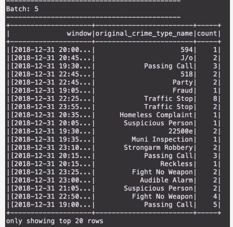
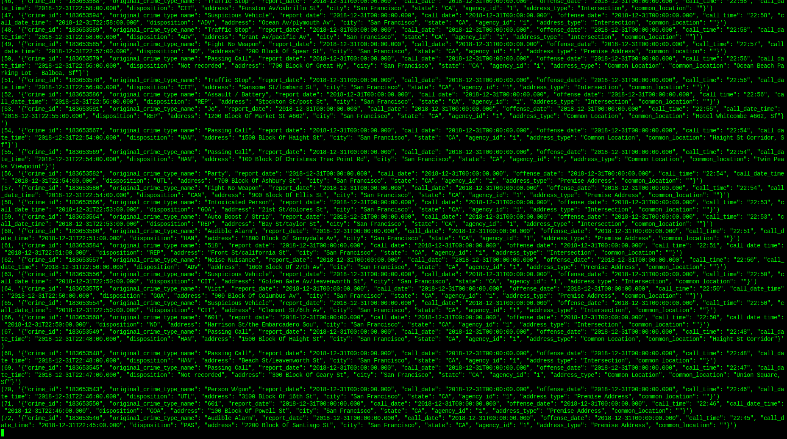

# SF Crime Statistics with Spark Streaming

## Overview

In this project, we use real world dataset from the kaggle repositories on San Francisco crime incidents. statistical analysis is performed on this data using Apache Spark Structured Streaming. A kafka server is used to produce and consume the data through spark structured streaming. The output of the submission is as bellow: 

### Data Stream
 

### Data consumer(Consumer console logs) 

## Project implementation

This project requires creating topics, starting Zookeeper and Kafka server, and your Kafka bootstrap server. Use the commands below to start Zookeeper and Kafka server.

`bin/zookeeper-server-start.sh config/zookeeper.properties`

`bin/kafka-server-start.sh config/server.properties`

- next step was to complete the `data_producer.py` file.

- The server is started by running

`python data_prodcuer.py`
- We create a `cons_server.py` script to consume data produced from the kafka producer. 

- Finally we do a spark-submit using the following command to obtain the requried results.

`spark-submit --packages org.apache.spark:spark-sql-kafka-0-10_2.11:2.3.0 --master local[4] data_stream.py`

### Requirements

- Spark 2.4.3
- Scala 2.11.x
- Java 1.8.x
- Kafka build with Scala 2.11.x
- Python 3.6.x or 3.7.x

### Environment setup

- Download Spark from https://spark.apache.org/downloads.html. Choose Prebuilt for Apache Hadoop 2.7 and later
- Unpack Spark in one of your folders (I usually put all my dev requirements in /home/users/user/dev)
- Download Scala from the official site or for Mac users, you can also use brew install scala but make sure you download version 2.11.x
- Make sure your ~/.bash_profile looks like below (might be different based on your directory):

` export SPARK_HOME=/Users/dev/spark-2.3.0-bin-hadoop2.7
 export JAVA_HOME=/Library/Java/JavaVirtualMachines/jdk1.8.0_181.jdk/Contents/Home
 export SCALA_HOME=/usr/local/scala/
 export PATH=$JAVA_HOME/bin:$SPARK_HOME/bin:$SCALA_HOME/bin:$PATH`
